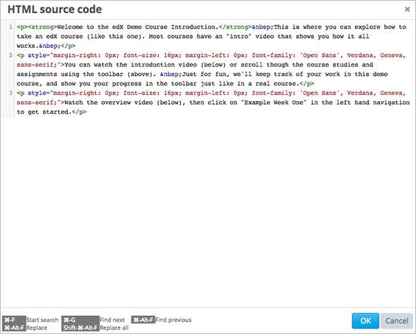

.. _Working with HTML Components:

#############################
Working with HTML Components
#############################

***********************
HTML Component Overview
***********************

HTML components are the most basic building blocks of your course. You use HTML components to add and format text, links, images, and more. 

For more information, see the following topics:

* :ref:`The HTML Editor`
* :ref:`Create an HTML Component`
* :ref:`Add a Link in an HTML Component`
* :ref:`Add an Image to an HTML Component`
* :ref:`Import LaTeX Code`

.. note:: Review :ref:`Organizing Your Course Content` and :ref:`Best Practices for HTML Markup` before you start working with HTML components.

To add an instant hangout to an HTML component, see :ref:`Using an Instant Hangout in Your Course`.

.. _The HTML Editor:

*****************************************
The HTML Editor
*****************************************

When you create a new HTML component, you work with the HTML editor:

The HTML editor provides a “what you see is what you get” (WYSIWYG) interface that allows you to format text by clicking the formatting buttons at the top of the editor. 

The following image shows callouts for the editing options and is followed by descriptions.

#. Choose a formatting style for the selected paragraph, such as heading 1, heading 2, or paragraph.
#. Choose a font family for selected text, such as Arial, Courier New, or Times New Roman.
#. Format selected text in bold.
#. Format selected text in italics.
#. Format selected text as code.
#. Underline selected text.
#. Create a bulleted list.
#. Create a numbered list.
#. Decrease and increased the indentation of the selected paragraph.
#. Format the selected paragraph as a blockquote.
#. Format text as code (i.e., in Courier font).
#. Create a link from the selected text.
#. Delete the current link.
#. Insert an image at the cursor.
#. Work with HTML source code, described below.

.. _Work with HTML code:

============================
Work with HTML code
============================

To work with HTML source code for the component, click the **Source code** icon in the HTML editor toolbar. The HTML source code editor opens:

Edit the HTML code as needed.  The source code editor attempts to ensure your HTML code is valid; for example, if you do not close a formatting tag, it inserts one at the end of the paragraph when you save the text.

You can search for and replace text in the HTML source code using the control keys at listed at the bottom of the editor. For example, use Control-F to search for specific text. The search field opens at the top of the editor:

.. image:: ../Images/HTML_source_code_search.png
  :alt: Image of the HTML source code editor with the search field circled

Click **OK** to apply your changes to the HTML editor and close the source code.

.. note:: Clicking **OK** in the source code editor does not save your changes to the HTML component.  You return to the visual HTML editor, where your changes are applied.  You must click **Save** to save your changes and close the component. If you click **Cancel**, the changes you made in the HTML source code are lost.

.. _Create an HTML Component:

*****************************
Create an HTML Component
*****************************

To create an HTML component:

1. Under **Add New Component**, click **html**.

  .. image:: ../Images/NewComponent_HTML.png
   :alt: Image of adding a new HTML component

2. In the list that appears, click **Text**.

  .. note:  You can also create a :ref:`Zooming Image` or :ref:`Image Modal`.

   An empty component appears at the bottom of the unit.

  .. image:: ../Images/HTMLComponent_Edit.png
   :alt: Image of an empty HTML component

3. In the empty component, click **Edit**.

   The HTML component editor opens in Visual view.

  .. image:: ../Images/HTMLEditor.png
   :alt: Image of the HTML component Visual view

4. Enter the text and formatting that you want, either by using the formatting buttons in Visual view or by manually adding HTML tags in HTML view.

5. Enter a display name (the name that you want students to see). To do this, click **Settings** in the upper-right corner of the component editor, and then enter text in the **Display Name** field.

   To return to the text editor, click **Editor** in the upper-right corner.

6. Click **Save** to save the HTML component.

You can also add links and images to HTML components. Or, you can import LaTeX code. For more information, see:

* :ref:`Add a Link in an HTML Component`
* :ref:`Add an Image to an HTML Component`
* :ref:`Import LaTeX Code`

.. _Add a Link in an HTML Component:

***********************************
Add a Link in an HTML Component
***********************************

To add a link to a website, course unit, or file in an HTML component, you'll work with the **Insert/Edit Link** dialog box.

.. image:: ../Images/HTML_Insert-EditLink_DBox.png
 :alt: Image of the Insert/Edit Link dialog box

For more information, see:

* :ref:`Add a Link to a Website`
* :ref:`Add a Link to a Course Unit`
* :ref:`Add a Link to a File`

.. _Add a Link to a Website:

============================
Add a Link to a Website
============================

To add a link to a website:

#. Select the text that you want to make into the link.

#. Click the link icon in the toolbar.

#. In the **Insert/Edit Link** dialog box, enter the URL of the website that you want in the **Link URL** field.

   .. image:: ../Images/HTML_Insert-EditLink_Website.png
    :alt: Image of the Insert/Edit Link dialog box

#. If you want the link to open in a new window, click the drop-down arrow next to the **Target** field, and then select **Open Link in a New Window**. If not, you can leave the default value.

#. Click **Insert**.

#. Save the HTML component and test the link.

.. _Add a Link to a Course Unit:

============================
Add a Link to a Course Unit
============================

You can add a link to a course unit in an HTML component.

#. Obtain the unit identifier of the unit you're linking to. To do this, open the unit page in Studio, and copy the unit ID from the **Unit Identifier** field under **Unit Location** in the right pane.
   
   .. image:: ../Images/UnitIdentifier.png
    :alt: Image of the unit page with the unit identifier circled

#. Open the HTML component where you want to add the link.

#. Select the text that you want to make into the link.

#. Click the link icon in the toolbar.

#. In the **Insert/Edit Link** dialog box, enter the following in the **Link URL** field.

   ``/jump_to_id/<unit identifier>``

   Make sure to replace <unit identifier> (including the brackets) with the unit
   identifier that you copied in step 2, and make sure to include both forward slashes (/).

   .. image:: ../Images/HTML_Insert-EditLink_CourseUnit.png
    :alt: Image of the Inser/Edit Link dialog box with a link to a unit identifier

#. If you want the link to open in a new window, click the drop-down arrow next to
   the **Target** field, and then select **Open Link in a New Window**. If not, you can leave the default value.

#. Click **Insert**.

#. Save the HTML component and test the link.

.. _Add a Link to a File:

============================
Add a Link to a File
============================

You can add a link in an HTML component to any file you've uploaded for the course. For more information about uploading files, see :ref:`Add Files to a Course`.

#. On the **Files & Uploads** page, copy the **Embed URL** of the file.

  .. image:: ../Images/HTML_Link_File.png
   :alt: Image of Files and Uploads page with the URL field circled 
  
  .. note:: You must use the **Embed URL** to link to the file, not the **External URL**.

2. Select the text that you want to make into the link.

#. Click the link icon in the toolbar.

#. In the **Insert/Edit Link** dialog box, enter the following in the **Link URL** field.

   ``/static/FileName.type``

   Make sure to include both forward slashes (/).

   .. image:: ../Images/HTML_Insert-EditLink_File.png
    :alt: Image of the Inser/Edit Link dialog box with a link to a file

#. If you want the link to open in a new window, click the drop-down arrow next to
   the **Target** field, and then select **Open Link in a New Window**. If not, you can leave the default value.

#. Click **Insert**.

#. Save the HTML component and test the link.

.. note::  When you add the file link in the format ``/static/FileName.type``, then later reopen the **Insert/Edit Link** dialog box, you see that the link changes to ``/c4x/edX/Course-name/asset/FileName.type``. This URL is OK and you do not need to change it. In the HTML view, the link appears as ``/static/FileName.type``.

.. _Add an Image to an HTML Component:

***********************************
Add an Image to an HTML Component
***********************************

You can add any image that you have uploaded for the course to an HTML component. For more information about uploading images, see :ref:`Add Files to a Course`.

.. note:: Review :ref:`Best Practices for Describing Images` when you add images to HTML components.

To add an image, you'll need the URL of the image that you uploaded to the course. You'll then create a link to the image in the HTML component.

#. On the **Files & Uploads** page, copy the **Embed URL** of the image that you want.

  .. image:: ../Images/image_link.png
   :alt: Image of the Files & Upload page with the Embed URL for the image circled

  .. note:: You must use the **Embed URL** to add the image, not the **External URL**.

2. Click the image icon in the toolbar.

#. In the **Insert/Edit Image** dialog box, enter the following in the **Image URL** field.

   ``/static/FileName.type``

   Make sure to include both forward slashes (/).

   .. image:: ../Images/HTML_Insert-Edit_Image.png
    :alt: Image of the Insert/Edit Image dialog box with a link to a file

4. Enter alternative text in the Image Description field. See :ref:`Best Practices for Describing Images` for more information.

#. As needed, in the **Insert/Edit Image** dialog box, customize the image alignment, dimensions, border, and vertical and horizontal space.

#. Click **Insert**.

#. Save the HTML component and test the image.

.. note::  When you add the image URL in the format ``/static/FileName.type``, then later reopen the **Insert/Edit Image** dialog box, you see that the URL changes to ``/c4x/edX/Course-name/asset/FileName.type``. This URL is OK and you do not need to change it. In the HTML view, the URL appears as ``/static/FileName.type``.

   ``

``

.. _Import LaTeX Code:

****************************************
Import LaTeX Code into an HTML Component
****************************************

You can import LaTeX code into an HTML component. You might do this, for example, if you want to create "beautiful math" such as the following.

.. image:: ../Images/HTML_LaTeX_LMS.png
 :alt: Image of math formulas created with LaTeX

.. warning:: The LaTeX processor that Studio uses to convert LaTeX code to XML is a third-party tool. We recommend that you use this feature with caution. If you do use it, make sure to work with your PM.

This feature is not enabled by default. To enable it, you have to change the advanced settings in your course. 

To create an HTML component that contains LaTeX code:

#. Enable the policy key in your course.

   #. In Studio, click **Settings**, and then click **Advanced Settings**.
   #. On the **Advanced Settings** page, scroll down to the **use_latex_compiler** policy key.
   #. In the **Policy Value** field next to the **use_latex_compiler** policy key, change **false** to **true**.
   #. At the bottom of the page, click **Save Changes**.

#. In the unit where you want to create the component, click **html** under **Add New Component**, and then click **E-text Written in LaTeX**. The new component is added to the unit.

#. Click **Edit** to open the new component. The component editor opens.

  .. image:: ../Images/latex_component.png
   :alt: Image of the HTML component editor with the Latex compiler.

4. In the componenent editor, click **Launch Latex Source Compiler**. The Latex editor opens.

   .. image:: ../Images/HTML_LaTeXEditor.png
    :alt: Image of the HTML component editor with the Latex compiler.

#. Write Latex code as needed. You can also upload a Latex file into the editor from your computer by clicking **Upload** in the bottom right corner.

#. When you have written or uploaded the Latex code you need, click **Save & Compile to edX XML** in the lower-left corner.

   The component editor closes, and the unit page opens. You can see the way your LaTeX content looks.

   .. image:: ../Images/HTML_LaTeX_CompEditor.png
    :alt: Image of the LaTeX component

#. On the unit page, click **Preview** to verify that your content looks the way you want it to in the LMS. 

   If you see errors, go back to the unit page. Click **Edit** to open the component again, and then click **Launch Latex Source Compiler** in the lower-left corner of the component editor to edit the LaTeX code.

